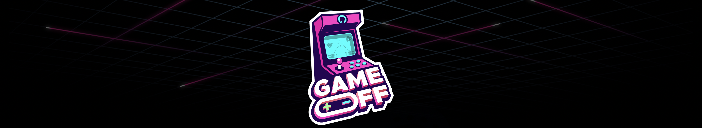

# Warlock
### A collectible card game that is easy to learn, fun, and challenging
made for the [Game Off game jam 2023](https://itch.io/jam/game-off-2023)

## Theme : SCALE

##### Project Genesis:
I am fascinated by Collectible Card Games (CCG). I am not really into it I haven't had the opportunity to get into it. So I decided to introduce myself to CCG.
I found CCG great and I wanted to allow other people who like me at the time didn't know much about card games to get an idea about what it is and why people find CCG so fun and challenging to play.
I hope you'll enjoy the experience.

##### Engine / Language : Godot 4 / GDScript 2
##### Supported platforms : Web - Windows - Linux
##### UI Language : French - English
##### Genre : Collectible Card Game
##### Controls : Mouse
##### Game mode : Solo

